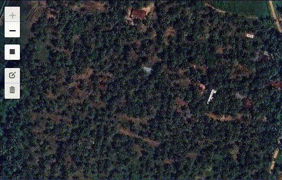
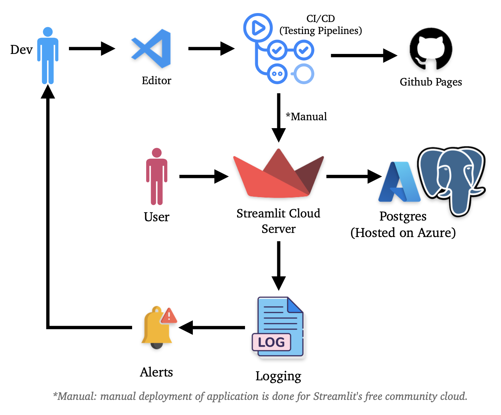
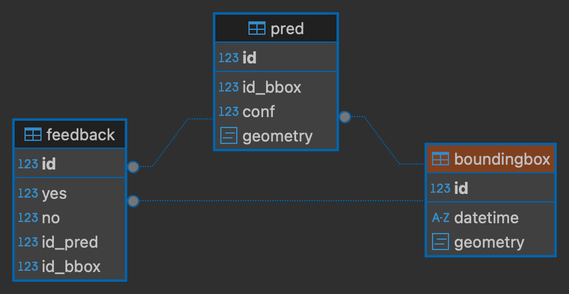

# cocolit 🌴

This app detects coconut trees over google satellite imagery.

the main motivation for building this app was to peek into how to design machine learning systems.
learned alot while building this app :)

# features 

- realtime inference.
- multiple bounds selection.
- realtime statistics for the usage of the app.
- feedback (collecting data for retraining the model).
- logging (with smtp handler to send alerts).
- ORM (sqlmodel)
- cloud based Database (Azure Postgres Database used).
- api (integration with FastAPI, implementation done, currently not in use).

## architecture
The architecture of this app is pretty simple. 

\*Manual: manual deployment of application is done for free tier streamlit cloud server

## database 

ERD diagram from DBeaver

# how to run

- first install docker 
- clone this repo
- make a `secrets.toml`
- run `docker compose up`